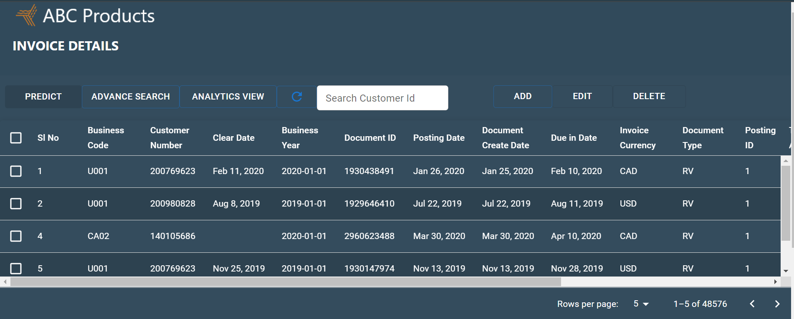

# B2B Invoice Management App

A B2B Invoice Management web application built using Java, Eclipse, MySQL, CSS, JavaScript, ReactJS, and Servlets. This app provides a comprehensive solution for managing invoices, offering functionalities like Add, Edit, Delete, Search, and Analytics view.

## Table of Contents

- [Tools & Technologies Used](#tools--technologies-used)
- [Features](#features)
- [Dashboard](#dashboard)
- [Data Visualization](#data-visualization)
- [Database](#database)
- [Installation](#installation)
- [Usage](#usage)
- [Contributing](#contributing)
- [License](#license)

## Tools & Technologies Used

- **Backend**:
  - Java
  - Eclipse
  - Servlets
  - MySQL

- **Frontend**:
  - ReactJS
  - JavaScript
  - CSS

## Features

- Add new invoices
- Edit existing invoices
- Delete invoices
- Search functionality
- Analytics view

## Dashboard

The dashboard is responsive and user-friendly, providing an intuitive interface for managing invoices. It offers functionalities such as adding new invoices, editing existing ones, deleting invoices, and searching for specific invoices.

## Data Visualization

Data is visualized using grids and graphs to provide insights into invoice management. The analytics view offers a comprehensive overview of invoices, helping businesses make informed decisions.

## Database

The app uses MySQL for storing invoice data. Data loading into the database is streamlined to ensure efficiency and reliability. The full-stack web application integrates the frontend and backend seamlessly, providing a cohesive user experience.

